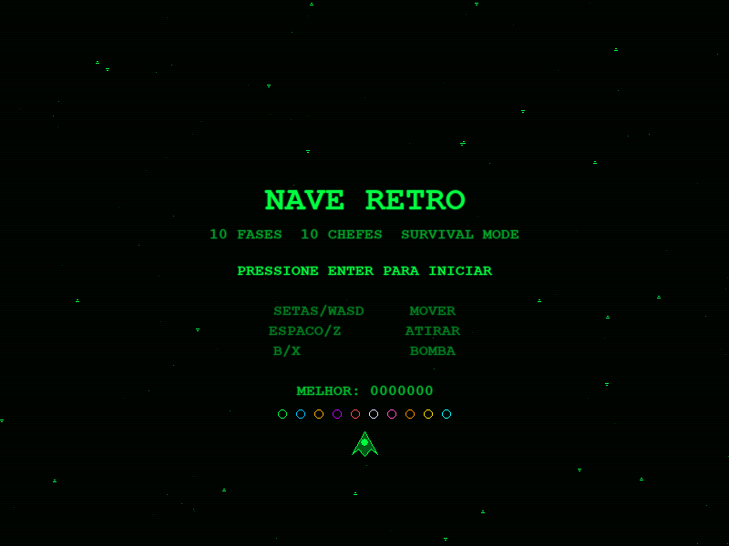

# PULSAR: SETOR ZERO

> *"A última frequência de resistência."*

Shoot 'em up retrô com visual CRT fósforo — scanlines, estrelas com parallax e efeitos retrô. Pilote a nave experimental PULSAR através de 10 setores corrompidos e enfrente o coração da invasão.



---

## História

**Ano 2247.** A humanidade expandiu pelo cosmos, dividindo o espaço conhecido em setores de colonização. Por décadas, a paz entre os setores foi mantida pela Aliança Interestelar.

Tudo mudou quando o **Setor Zero** ativou.

Setor Zero não estava nos mapas. Ninguém sabia de onde veio. Em questão de semanas, frotas inimigas de origem desconhecida começaram a surgir — setor por setor, consumindo tudo em seu caminho. Cada região conquistada se tornava mais sombria, corrompida pelas cores da invasão.

A Aliança perdeu 9 frotas tentando deter o avanço. Nenhuma retornou.

Em desespero, os cientistas do **Projeto PULSAR** ativaram o único protótipo restante: uma nave experimental alimentada por energia de estrelas de nêutrons, capaz de adaptar sua frequência de combate conforme avança pelos setores inimigos.

**Você é o piloto. Não há equipe. Não há backup.**

Seu objetivo: atravessar os **10 setores corrompidos**, eliminar cada comandante inimigo e alcançar o Setor Zero — o coração da invasão — antes que o último pulsar do universo se apague para sempre.

---

## Funcionalidades

- **Visual CRT retrô** — fundo escuro, scanlines, efeito fósforo
- **Parallax de estrelas** — 3 camadas em velocidades distintas, sensação real de movimento
- **Nave PULSAR** com movimento livre por toda a tela
- **10 tipos de inimigos** com comportamentos distintos:
  - Padrão, Rápido (diamante), Pesado (hexágono 3HP)
  - Zigue-zague, Bombardeiro, Varredor, Kamikaze
  - Torre (fogo rápido), Elite (duplo diamante), Destruidor (mini-chefe 4HP)
- **Asteroides** em dois tamanhos — sem disparo, puro obstáculo
- **Power-ups dropeados** por inimigos:
  - **Cristal (PWR)** — aumenta o nível do disparo até 5 (spread de 1 a 5 tiros)
  - **Bomba (BOMB)** — adiciona 1 bomba (máx. 5)
- **Bomba especial** — destroi tudo na tela com explosão visual
- **10 comandantes (chefes)** únicos, um por setor:

| Setor | Cor | Chefe |
|-------|-----|-------|
| 1 | Verde | Cruzador Asa-Delta |
| 2 | Ciano | Caranguejo de Guerra |
| 3 | Âmbar | Canhoneira Orbital |
| 4 | Violeta | Dreadnought Fortaleza |
| 5 | Vermelho | Fantasma Dimensional |
| 6 | Branco | Cristalino Pulsante |
| 7 | Rosa | Nave-Mãe |
| 8 | Laranja | Tempestade de Fogo |
| 9 | Dourado | Titã Encouraçado |
| 10 | Final | **Soberano Zero** |

- **10 vidas** por partida + **5 continues** com tela de seleção
- **Contagem regressiva de 10s** na tela de continue — sem resposta, volta ao menu
- **Highscore** salvo em `highscore.json`
- **Música e sons** gerados por código — sem arquivos externos

---

## Controles

| Tecla | Ação |
|-------|------|
| `↑ ↓ ← →` / `W A S D` | Mover a nave |
| `Espaço` / `Z` | Atirar |
| `B` / `X` | Lançar bomba |
| `Esc` | Sair |

## Sistema de Continues

Ao perder todas as 10 vidas, aparece a tela de continue com **contagem regressiva de 10 segundos**:

| Tecla | Ação |
|-------|------|
| `S` / `Enter` | Continuar do setor atual (restaura 10 vidas) |
| `N` / `R` | Recomeçar do início |
| *(sem input)* | Volta ao menu após 10 segundos |

Após esgotar os **5 continues**, missão encerrada — **GAME OVER**.

---

## Requisitos

```bash
pip install pygame
```

## Como jogar

```bash
python jogo.py
```

---

## Desenvolvido por

**Leandro Oliveira Moraes** — [github.com/leandroninja](https://github.com/leandroninja)
